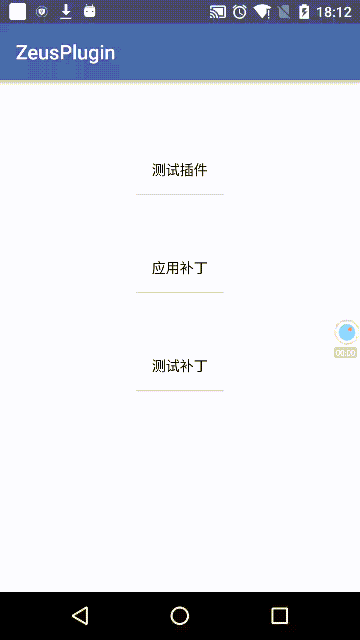

# ZeusPlugin

**可能是最精简的插件补丁框架**

 

## 支持特性

1. 支持插件的安装、升级、卸载、版本管理
2. 支持插件调用宿主的类与资源。要在插件中使用宿主的资源ID，需要使用public.xml将资源ID固定，public.xml如何使用请自行搜索，并将该ID添加到sdk-jar中，如果只是插件调用宿主中的某个类，然后这个使用了宿主资源则不需处理。
3. 支持运行时动态升级加载插件。调用PluginManager.getPlugin(pluginId).install()安装完成之后，只需要调用`PluginManager.loadLastVersionPlugin(pluginName)`如果没加载过插件会加载最新插件，如果已加过老版本的该插件则会替换为该插件的最新版本。
4. 插件与宿主的关系和apk与android系统的关系接近。
    **如果插件中有与宿主重名的类，这个插件中的类只能被插件使用，宿主是不会使用插件中的类的。宿主只能通过显式loadClass的方式才能访问插件。**
5. 当插件版本过多又怕新插件在早期apk中不支持，应编写一个类CTS测试(google强制厂商执行的兼容性测试)的小插件，该插件中会调用所有之前插件用到的宿主中的所有方法和成员等等。如果该小程序跑过了则说明新版本apk兼容所有插件。
6. 支持so以及so的动态实时升级。
7. 插件与补丁支持加固方案，单dex或者多个dex文件情况，已对android 1.5以上版本(已适配最新的android N)和厂商定制的android系统进行了适配，适配了各种机型和厂商自己的系统(包括yunOS等)。测试无资源加载找不到的问题，存在极个别的第一次加载后类找不到的情况，尝试几次就可以了。(概率极低，<0.0001%)
8. 对性能无明显影响。经过在android 2.2及以上进行高强度测试，对性能无明显影响。
9. 支持bug fix的补丁功能，补丁修复最小单位是java中的class，补丁中可以有资源，也可以使用宿主的资源，它其实跟插件是一样的，只不过补丁的class与宿主的class重名了，发现重名就替换，支持单dex、多dex(方法数超了的情况)。补丁对性能有微弱影响(个人认为可以忽略)，android 4.4及以上完全无影响。
10. 如果你的apk没有进行代码混淆，补丁也可以产生与插件相同的作用来进行功能的更新。

## 不支持的特性

1. 不支持插件中使用activity动画。如果要使用activity动画请将activity动画用到的xml文件放到宿主中，否则卡死。
2. 不支持插件有自己的Application，插件获取的是宿主的application。
3. 不支持动态升级插件的AndroidManifest.xml文件，所有试图修改AndroidManifest.xml的功能都需要升级宿主。不过这种情况很少，目前我们还没遇到过。
4. 不支持补丁实时加载，下次启动才能加载，否则内存中的对象会乱掉，如之前保存了A类的实例，现在A类已经被实时替换为B类了，那么之前的A类实例就不能转为B类了。
5. 不支持插件在xml使用宿主的自定义属性。(支持这个性价比太低，请使用其他替代方法)
6. 其他还不清楚，还请大家进行测试。

## 文档

使用方法及代码原理见 [Zeus Wiki](https://github.com/iReaderAndroid/ZeusPlugin/wiki)

## 欢迎加群交流讨论

> QQ群：`558449447`，添加请注明来自`ZeusPlugin`
>
> <a target="_blank" href="http://shang.qq.com/wpa/qunwpa?idkey=4464e9ee4fc8b05ee3c4eeb4f4be97469c1cfe46cded6b00f4a887ebebb60916"></a>
>
> 欢迎各位参加测试，该项目会持续维护。
>
>
> 另：欢迎加入[掌阅](http://www.zhangyue.com/jobs)大家庭，一起研究Android新技术。简历请发送`huangjian@zhangyue.com`,注明应聘方向。
>
# LICENSE

```
MIT LICENSE 
Copyright (c) 2016 zhangyue

Permission is hereby granted, free of charge, to any person obtaining
a copy of this software and associated documentation files (the
"Software"), to deal in the Software without restriction, including
without limitation the rights to use, copy, modify, merge, publish,
distribute, sublicense, and/or sell copies of the Software, and to
permit persons to whom the Software is furnished to do so, subject to
the following conditions:

The above copyright notice and this permission notice shall be
included in all copies or substantial portions of the Software.

THE SOFTWARE IS PROVIDED "AS IS", WITHOUT WARRANTY OF ANY KIND,
EXPRESS OR IMPLIED, INCLUDING BUT NOT LIMITED TO THE WARRANTIES OF
MERCHANTABILITY, FITNESS FOR A PARTICULAR PURPOSE AND
NONINFRINGEMENT. IN NO EVENT SHALL THE AUTHORS OR COPYRIGHT HOLDERS BE
LIABLE FOR ANY CLAIM, DAMAGES OR OTHER LIABILITY, WHETHER IN AN ACTION
OF CONTRACT, TORT OR OTHERWISE, ARISING FROM, OUT OF OR IN CONNECTION
WITH THE SOFTWARE OR THE USE OR OTHER DEALINGS IN THE SOFTWARE.
```
